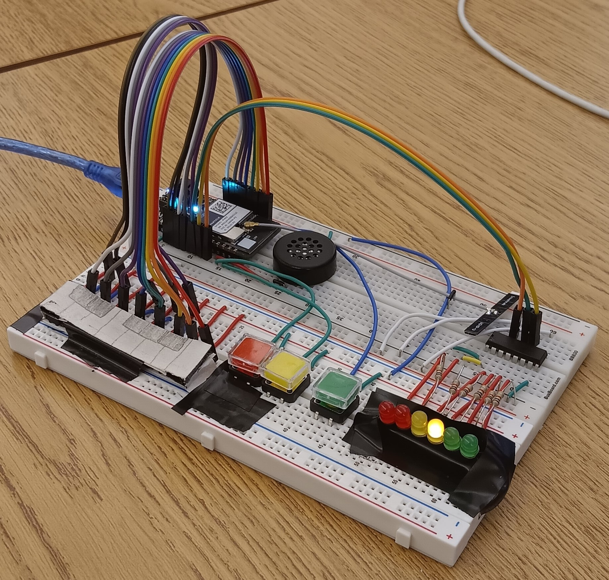

# Unisynth

Unisynth is a breadboard synthesizer, this is my final project for EE1301.

This project has IOT capabilities. The web piano interface is available under public/index.html

This project uses particle workbench and p5js.

[video presentation](https://www.youtube.com/watch?v=Ok09oF9jXIg)